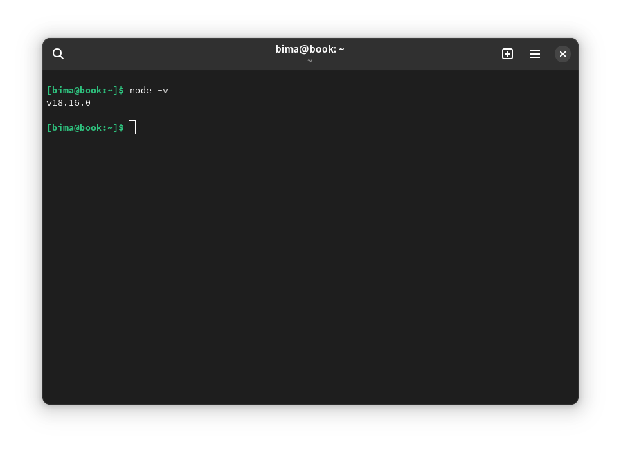

Halo semua!

Hari ini, saya akan membagikan panduan langkah demi langkah tentang cara membuat aplikasi menggunakan ReactJS. ReactJS adalah salah satu library JavaScript yang populer untuk membangun antarmuka pengguna (UI) yang interaktif dan responsif. Mari kita mulai!

## Langkah 1: Persiapan Lingkungan Kerja
Sebelum memulai, pastikan kamu memiliki Node.js terinstal di komputer kamu. Jika belum, unduh dan instal Node.js dari situs resmi Node.js. Setelah itu, buka terminal atau command prompt dan jalankan perintah `node -v` untuk memastikan instalasi berhasil. Selanjutnya, kamu perlu menginstal Create React App dengan menjalankan perintah `npm install -g create-react-app`. Dengan ini, kamu dapat dengan mudah membuat proyek ReactJS.

## Langkah 2: Membuat Proyek ReactJS
1. Buka terminal atau command prompt, lalu pindah ke direktori tempat kamu ingin membuat proyek ReactJS.
2. Jalankan perintah `npx create-react-app nama-proyek` untuk membuat proyek baru. Gantilah "nama-proyek" dengan nama yang kamu inginkan untuk proyek kamu.
3. Setelah proses selesai, masuk ke direktori proyek dengan menjalankan perintah `cd nama-proyek`.

## Langkah 3: Mengedit Aplikasi ReactJS
1. Di dalam direktori proyek, kamu akan menemukan struktur file proyek ReactJS yang sudah dibuat.
2. Buka proyek menggunakan editor teks atau Integrated Development Environment (IDE) pilihan kamu.
3. File utama aplikasi ReactJS terletak di direktori `src`. kamu dapat mulai mengedit file `src/App.js` untuk mengubah konten tampilan aplikasi. kamu juga bisa membuat komponen baru dan mengimpornya ke dalam file `App.js`.
4. Selain itu, kamu juga bisa mengedit file `src/index.js` jika diperlukan, tetapi dalam proyek sederhana biasanya tidak perlu dilakukan.

## Langkah 4: Menjalankan Aplikasi ReactJS
1. Kembali ke terminal atau command prompt, pastikan kamu masih berada di direktori proyek ReactJS.
2. Jalankan perintah `npm start` untuk menjalankan aplikasi ReactJS dalam mode pengembangan.
3. Buka browser dan akses `http://localhost:3000`. kamu akan melihat tampilan aplikasi ReactJS kamu di sana.
4. Setiap kali kamu menyimpan perubahan pada file proyek, halaman akan secara otomatis dimuat ulang di browser.

## Langkah 5: Menerapkan Fungsionalitas Tambahan
1. Untuk menambahkan fungsionalitas tambahan seperti penggunaan API atau routing, kamu dapat menggunakan library ReactJS yang sesuai seperti Axios atau React Router.
2. Instal library yang kamu butuhkan dengan menjalankan perintah `npm install nama-library`.

Selamat! kamu telah berhasil membuat aplikasi menggunakan ReactJS. Sekarang kamu dapat mulai mengembangkan aplikasi yang lebih kompleks dengan memanfaatkan fitur-fitur yang ditawarkan oleh ReactJS.

Semoga panduan ini bermanfaat bagi kamu yang ingin mempelajari ReactJS!